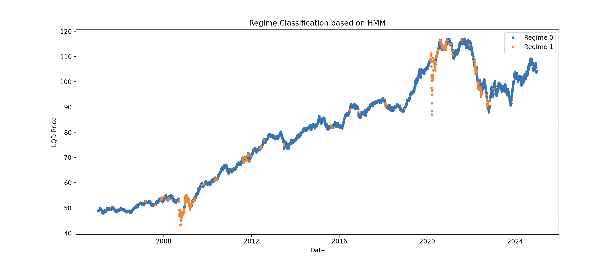

# Regime-Switching Quant Strategy

This project implements a regime-aware quantitative trading strategy using Hidden Markov Models (HMMs) to detect and adapt to market regimes (e.g., "crisis" vs. "normal"). The goal is to build a backtestable signal and visualize strategy performance on fixed-income ETFs.

## Project Overview

The strategy focuses on identifying regime shifts in the corporate bond market using:

- **Asset:** [iShares iBoxx $ Investment Grade Corporate Bond ETF (LQD)](https://www.ishares.com/us/products/239566/ishares-iboxx-investment-grade-corporate-bond-etf)
- **Model:** Gaussian Hidden Markov Model (HMM)
- **Objective:** Classify market states to enable regime-dependent trading logic

## Context: Black Swan Risk Research

This project was developed as a technical complement to an article I'm writing on **Black Swan risk** in corporate debt markets — part of an upcoming series on hidden risks in financial systems.

The strategy serves as a practical demonstration of how **statistical regime detection** can help flag early signs of systemic stress, particularly in asset classes that are assumed to be stable (e.g., investment-grade bonds).

By applying a Hidden Markov Model to corporate bond price data, the strategy aims to:

- Capture nonlinear transitions between "normal" and "crisis" regimes
- Expose the fragility of bond markets during volatility spikes
- Inform more adaptive, risk-aware allocation strategies

## Key Components

- `regime_switching_strategy.py`  
  - Loads historical price data for LQD via `yfinance`
  - Calculates log returns
  - Fits a 2-regime Gaussian HMM
  - Classifies each data point into a regime
  - Visualizes closing prices colored by regime

## Sample Output

The script produces a visual output like the one below, with prices colour-coded based on the predicted regime (normal or crisis):

